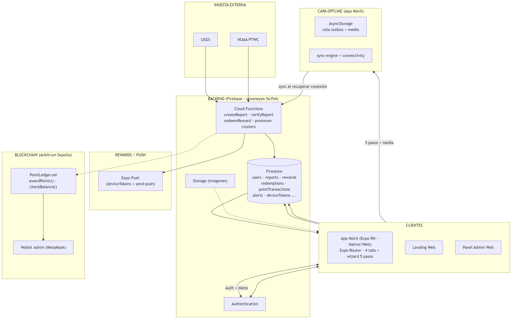

# OceanEyes — Arquitectura del Sistema

> **Vigilancia ciudadana del mar.** Protege el océano, reporta en segundos.
> Documento de arquitectura generado para la Hackathon Ethereum Lima 2026.

---

## Descripción por capa

### 1. Clientes (monorepo Expo SDK 54 · TypeScript 5.9)

- **App móvil** (`src/mobile`): navegación file-based con Expo Router. Tabs Inicio / Reportes / Recompensas / Perfil con FAB central. Wizard de reporte en 5 pasos (DNI → foto/video → ubicación → incidente + audio → resumen).
- **Landing web** (`src/landing`): secciones Hero, Features, Download, FAQ, Contacto.
- **Panel Admin** (`src/admin`): Dashboard con KPIs y gráficos SVG, moderación de reportes, gestión de usuarios, alertas, canjes, recompensas, municipalidades, ONGs y bans.

### 2. Capa offline (app móvil)

Los reportes se encolan en **AsyncStorage** (`offline/outbox.ts`) con su multimedia (`offline/media.ts`); `sync-engine.ts` los sube a Firestore al recuperar conexión (`connectivity.ts`). El ciudadano puede reportar sin red.

### 3. Backend (Firebase)

- **Proyecto**: `oceaneyes-5e7b4` · Región `southamerica-east1` · Plan Spark (gratuito).
- **Authentication**: registro/login por email; roles `fisher` | `citizen` | `admin`.
- **Firestore**: colecciones core `users`, `reports`, `rewards`, `redemptions`, `pointTransactions` y de fase 2 `alerts`, `municipalities`, `organizations`, `campaigns`, `deviceTokens`.
- **Cloud Functions**: `createReport`, `verifyReport` (otorga puntos + transacción + registro on-chain), `redeemReward` (atómico) y promoción de clústeres de alertas.
- **Storage**: limitado por el plan Spark; el reporte se guarda igual aunque la foto no se suba (requiere plan Blaze).

### 4. Blockchain (Arbitrum Sepolia)

- Contrato **`PointLedger.sol`** desplegado en `0xbA7A9d6cB7581Ef28cD01c77813bA229Cb2B1509` y verificado en Arbiscan.
- `ethers` v6: `awardPointsOnChain` con overrides EIP-1559 (gas 2× recomendado) en `verifyReport`. Idempotencia contra doble acreditación.
- Registro del `txHash` en `reports` y `pointTransactions`; KPI "On-chain" en el dashboard admin.

### 5. Alertas y notificaciones

- Ingesta de **USGS** y **NOAA PTWC** vía poller admin, deduplicación por `externalId`.
- Alertas ciudadanas por clústeres (`alertReports` + CF `promoteAlertCluster`); las `danger` requieren aprobación admin.
- Mapa de calor tipo Waze con densidad y filtros por categoría (native + web).
- **Expo Push**: registro de `deviceTokens` + endpoint `POST /api/send-push`.

---

## Flujo principal: reporte ciudadano

1. **Creación** — El ciudadano completa el wizard de 5 pasos; si no hay red, el reporte se encola en la cola offline.
2. **Sincronización** — `sync-engine` sube el reporte cuando recupera conexión; `createReport` lo guarda en Firestore con `status: pendiente`.
3. **Verificación** — El admin revisa en `/admin/reports` y lo marca `verificado` o `descartado`.
4. **Puntos on-chain** — `verifyReport` otorga puntos y llama `awardPoints()` en Arbitrum → se registra el `txHash`.
5. **Canje** — El saldo se actualiza y el usuario puede canjear recompensas (`redeemReward` atómica).

---

## Stack tecnológico

| Capa | Tecnología |
|------|-----------|
| Framework | Expo (React Native) SDK 54 · Expo Router v6 |
| Lenguaje | TypeScript 5.9 |
| UI | React Native 0.81 · React Native Web 0.21 · reanimated |
| Backend | Firebase Auth + Firestore + Cloud Functions (plan Spark) |
| Offline | AsyncStorage + cola propia (`src/mobile/shared/offline/`) |
| Blockchain | Arbitrum Sepolia · ethers ^6.17 |
| Alertas | USGS · NOAA PTWC · Expo Push |
| Lint | ESLint (eslint-config-expo) |

---

## Documentación relacionada

| Documento | Contenido |
|-----------|-----------|
| `docs/PROJECT.md` | Visión general del proyecto |
| `docs/STATUS.md` | Estado actual + esquema Firestore completo |
| `docs/ARBITRUM_PLAN.md` | Plan de integración Arbitrum (contratos, fases, entregables) |
| `docs/FIREBASE_SETUP.md` | Setup de Firebase |